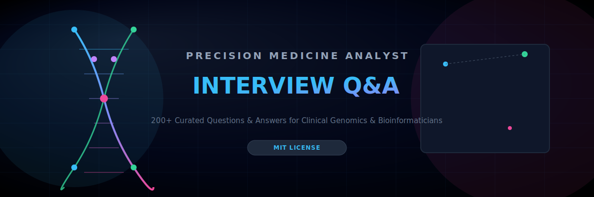

<p align="center">
  
</p>

<!--
SEO Meta Details:
- Keywords: Precision Medicine Analyst, Genomics, Variant Interpretation, Bioinformatics, Pharmacogenomics, Clinical Trial Biomarkers, EHR Pipelines, Multi-Omics, Biostatistics, Real-World Evidence
- Description: Complete guide & Q&A resource for Precision Medicine Analyst interview prep covering variant curation, clinical pipelines, genomics, biostatistics, and regulatory compliance.
-->

# 🧬 Awesome Precision Medicine Analyst Interview Q&A

<p align="center">
  <a href="https://github.com/ishandutta2007/Awesome-Awesome-Awesome"></a><a href="https://discord.gg/jc4xtF58Ve"></a><a href="https://opensource.org/licenses/MIT"></a><a href="https://github.com/ishandutta2007/Awesome-Precision-Medicine-Analyst-Interview-QA/stargazers"></a><a href="https://github.com/ishandutta2007/Awesome-Precision-Medicine-Analyst-Interview-QA/network"></a><a href="https://github.com/ishandutta2007"></a>
</p>

A comprehensive, community-curated collection of **200+ interview questions and answers** specifically tailored for **Precision Medicine Analyst** roles. 🚀 This repository is a preparation resource for candidates targeting positions at the intersection of genomics, clinical data science, bioinformatics, and personalized therapeutics. 🔬

## 📌 Overview

**Precision Medicine Analysts** interpret multi-omic and clinical data to guide individualized diagnosis, treatment selection, and risk stratification. The role blends statistical genetics, clinical informatics, regulatory awareness, and translational biology.

This repository covers:
- ✅ Genomics & variant interpretation
- ✅ Pharmacogenomics (PGx)
- ✅ Clinical trial biomarker analysis
- ✅ Multi-omic data integration (genomics, transcriptomics, proteomics)
- ✅ EHR/clinical data pipelines
- ✅ Statistical & ML methods for precision medicine
- ✅ Regulatory, ethical & privacy considerations
- ✅ Real-world evidence (RWE) and outcomes research

**Estimated preparation time:** 30–50 hours
**Interview duration:** Typically 4–6 technical rounds (3–4 hours total)

---

## 📚 Repository Structure

```
Awesome-Precision-Medicine-Analyst-Interview-QA/
├── README.md
├── CONTRIBUTING.md
├── LICENSE
├── topics/
│   ├── 01-Genomics-Fundamentals.md
│   ├── 02-Variant-Interpretation.md
│   ├── 03-Pharmacogenomics.md
│   ├── 04-Multi-Omic-Integration.md
│   ├── 05-Clinical-Data-Pipelines.md
│   ├── 06-Biostatistics-ML-Methods.md
│   ├── 07-Clinical-Trial-Biomarkers.md
│   ├── 08-Real-World-Evidence.md
│   ├── 09-Regulatory-Compliance-Privacy.md
│   ├── 10-System-Architecture-Data-Engineering.md
│   ├── 11-Troubleshooting-Case-Studies.md
│   └── 12-Industry-Context-Ethics.md
├── docs/
│   ├── glossary.md
│   ├── resources.md
│   └── roadmap.md
└── .gitignore
```

---

## 🎯 Topic Breakdown

| # | Topic | Focus Area | Q&A Count |
|---|-------|-----------|-----------|
| 01 | Genomics Fundamentals | Sequencing, reference genomes, variant calling | 18 |
| 02 | Variant Interpretation | ACMG guidelines, pathogenicity, VUS | 17 |
| 03 | Pharmacogenomics | Drug-gene interactions, dosing guidelines | 16 |
| 04 | Multi-Omic Integration | Genomics + transcriptomics + proteomics | 16 |
| 05 | Clinical Data Pipelines | EHR, HL7/FHIR, data harmonization | 16 |
| 06 | Biostatistics & ML Methods | Survival analysis, feature selection, validation | 17 |
| 07 | Clinical Trial Biomarkers | Companion diagnostics, endpoint selection | 15 |
| 08 | Real-World Evidence | Claims data, registries, causal inference | 15 |
| 09 | Regulatory, Compliance & Privacy | FDA, HIPAA, GDPR, informed consent | 16 |
| 10 | System Architecture & Data Engineering | Pipelines, scalability, cloud genomics | 16 |
| 11 | Troubleshooting & Case Studies | Debugging pipelines, QC failures | 15 |
| 12 | Industry Context & Ethics | Health equity, incidental findings, market | 15 |
| | **TOTAL** | | **192** |

---

## 🚀 How to Use This Repository

### For Candidates
1. **Assess your baseline** – Start with Topic 01 if new to genomics.
2. **Learn in blocks** – One topic (45–60 min) per session.
3. **Active recall** – Cover the answer, explain aloud, then verify.
4. **Deep dives** – Use the Glossary and Resources for unfamiliar concepts.
5. **Mock interviews** – Pair with a peer or use Interview Scenarios.

### Study Plan (6 Weeks)
- **Week 1:** Topics 01–02 (Genomics + Variant Interpretation)
- **Week 2:** Topics 03–04 (Pharmacogenomics + Multi-Omics)
- **Week 3:** Topics 05–06 (Clinical Pipelines + Biostatistics)
- **Week 4:** Topics 07–08 (Trial Biomarkers + RWE)
- **Week 5:** Topics 09–10 (Regulatory + Systems)
- **Week 6:** Topics 11–12 + Mock Interviews + Review

---

## 📖 Quick Start Example

**From Topic 02: Variant Interpretation**

> **Q: How do you classify a novel missense variant using ACMG/AMP guidelines when population frequency data is limited?**
>
> **A:** Apply the ACMG/AMP 2015 framework combining population, computational, functional, and segregation evidence. For rare/novel variants: check gnomAD frequency (PM2 if absent/rare), in-silico predictors (PP3 if multiple tools agree deleterious), and case-level data (PS4 if enriched in affected cohort vs. controls). Combine evidence strength (Pathogenic, Likely Pathogenic, VUS, Likely Benign, Benign) using the ACMG point-based or Bayesian framework. Absent functional data, most novel missense variants default to VUS pending further evidence (RNA studies, segregation, functional assays).

---

## 🤝 Contributing

See **[CONTRIBUTING.md](CONTRIBUTING.md)** for guidelines on adding Q&As, improving answers, and proposing new topics.

**Areas seeking contributions:**
- Emerging modalities (spatial transcriptomics, liquid biopsy, single-cell multi-omics)
- Regional regulatory pathways (EMA, PMDA, NMPA)
- Translated versions
- De-identified case studies

---

## 📜 License

MIT License — see **[LICENSE](LICENSE)**.

---

## 🌟 Acknowledgments

Built by and for the precision medicine, clinical genomics, and health data science community.

---

**Last Updated:** July 2026
**Contributors:** 1 (growing!)
